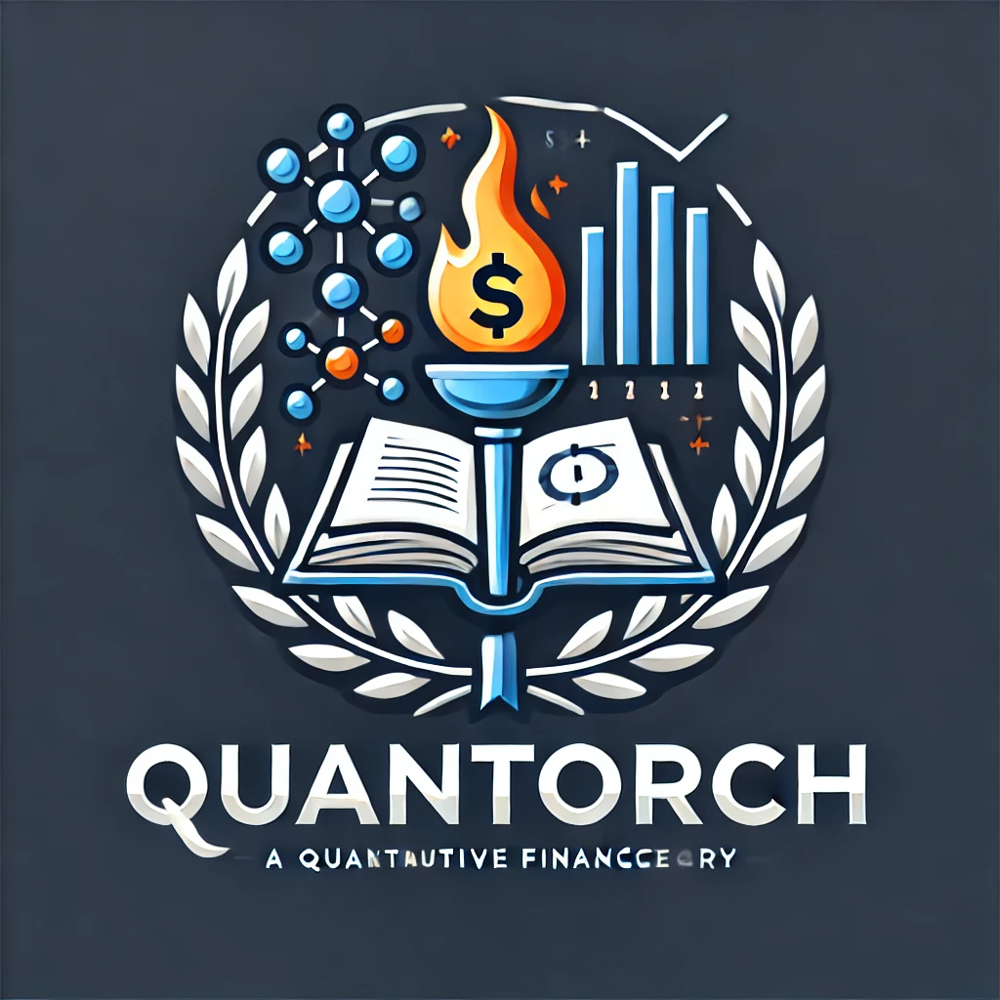

<div align=center>

</div>

<div align=center>

[](https://github.com/jialuechen)


[](https://pytca.readthedocs.io/en/latest/?badge=latest)

# PyTorch for Quant Finance
</div>

## Introduction
QuanTorch is developed to empower derivatives modeling and pricing by incorporating deep learning computation and acceleration service. QuanTorch provides high-performance components leveraging the hardware acceleration support and automatic differentiation of PyTorch. QuanTorch supports foundational mathematical methods, mid-level methods, and specific pricing models, which is also an experimental light-weight alternative to QuantLib.

## Motivation
PyTorch provides two high-level features: 

* Tensor computing with strong acceleration via GPU
* Automatic Differentiation System

Quantorch makes use of these modern features on PyTorch library to build advanced stochastic models, high-performance pricing_models, PDE solvers and numerical methods.

## Installation
```
pip install --upgrade quantorch
```

## Example
* Refined Black-Scholes-Merton Framework
```
from quantorch.core.optionPricer import OptionPricer
from torch import Tensor

optionType='european',optionDirection='put',\
spot=Tensor([100,95]),strike=Tensor([120,80]),\
expiry=Tensor([1.0,0.75]),volatility=Tensor([0.1,0.3]),\
rate=Tensor([0.01,0.05]),dividend=Tensor([0.01,0.02]),\

pricingModel='BSM'

# here we use GPU accleration as an example

if torch.cuda.is_available():
   device=torch.device("cuda")
   spot=spot.to(device)
   strike=strike.to(device)
   expiry=expiry.to(device)
   volatility=volatility.to(device)
   rate=rate.to(device)

# call the forward function in BSM pricing model
OptionPricer.price(
    optionType,
    optionDirection,
    spot,
    strike,
    expiry,
    volatility,
    rate,
    dividend,
    pricingModel,
    device='GPU'
    )
```

```
import torch
from quantorch.models.rw import utils
from quantorch.models.rw import rw
import networkx as nx

g = nx.Graph()

g.add_edge("A","B")
g.add_edge("A","C")
g.add_edge("B","C")
g.add_edge("B","D")
g.add_edge("D","C")

row, col = utils.to_csr(g)
nodes = utils.nodes_tensor(g)

# using GPU
device="cuda"
row = row.to(device)
col = col.to(device)
nodes = nodes.to(device)

walks = rw.walk(row=row,col=col,target_nodes=nodes,p=1.0,q=1.0,walk_length=6,seed=10)
```


### Greeks Calculation using Malliavin Calculus
```python
from quantorch.core.optionPricer import OptionPricer

# Define option parameters
spot = 100.0
strike = 100.0
expiry = 1.0
volatility = 0.2
rate = 0.05
dividend = 0.0

# Calculate Greeks using Malliavin method
greeks = OptionPricer.calculate_greeks(
    optionType='european',
    optionDirection='call',
    spot=spot,
    strike=strike,
    expiry=expiry,
    volatility=volatility,
    rate=rate,
    dividend=dividend,
    method='malliavin',
    num_paths=100000,
    num_steps=252
)

print("Greeks calculated using Malliavin method:")
for greek, value in greeks.items():
    print(f"{greek.capitalize()}: {value:.6f}")
```

This example demonstrates how to use QuanTorch's Malliavin calculus module to calculate option Greeks with high precision. The `calculate_greeks` method utilizes Monte Carlo simulation with Malliavin weights to compute Delta, Gamma, and Vega for European options.

* Binomial Tree Option Pircing Model
* Root-Finding Algorithms
* Random Walk
* Monte Carlo Simulation
* Risk Management (e.g., Greeks Calculation, Hedging)
* Bayesian Inference

## Roadmap

QuanTorch is continuously evolving to meet the needs of quantitative finance professionals. Here's our roadmap for future development:

1. Q3 2024: Enhanced Model Suite
   - Implement Heston stochastic volatility model
   - Add support for Asian options pricing
   - Develop a comprehensive suite of fixed income models

2. Q4 2024: Advanced Risk Management Tools
   - Implement Value at Risk (VaR) and Expected Shortfall calculations
   - Develop stress testing frameworks
   - Add support for portfolio optimization techniques

3. Q1 2025: Machine Learning Integration
   - Implement neural network-based option pricing models
   - Develop reinforcement learning algorithms for trading strategies
   - Add support for time series forecasting using LSTM and transformer models

4. Q2 2025: High-Performance Computing
   - Optimize core algorithms for multi-GPU support
   - Implement distributed computing capabilities for large-scale simulations
   - Develop a C++ backend for critical performance bottlenecks

5. Q3 2025: Extended Asset Classes
   - Add support for cryptocurrency derivatives
   - Implement models for commodity futures and options
   - Develop frameworks for exotic derivatives and structured products

6. Ongoing Initiatives:
   - Continuous performance optimization
   - Regular updates to align with the latest PyTorch releases
   - Expansion of documentation and educational resources
   - Community-driven feature development and bug fixes

We're committed to making QuanTorch a robust and versatile tool for quantitative finance. Your feedback and contributions are welcome as we work towards these goals.

## License

Apache-2.0