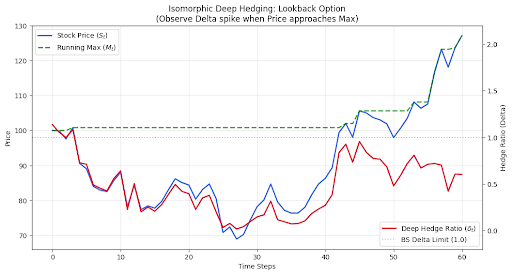
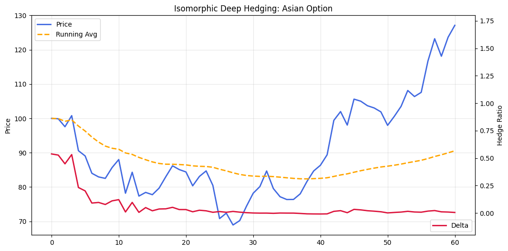

<div align=center>


[](https://badge.fury.io/py/torchquantlib)
[](https://opensource.org/licenses/Apache-2.0)
[](https://pepy.tech/projects/torchquantlib)


[](https://torchquant.readthedocs.io/en/stable/?badge=stable)

</div>

**TorchQuant** is a high-performance, differentiable quantitative finance library built on top of PyTorch's automatic differentiation and GPU acceleration. It provides comprehensive tools for derivatives pricing, risk management, and stochastic model calibration. The core innovation in this pytorch extension library is to delicately convert various exotic characteristics into corresponding deep learing mechanisms (see the below table). More kinds of derivatives will be supported as the library grows.

## Financial Instruments and Deep  Mechanisms Analogy (Partial Examples)

This table outlines the analogy between financial instruments and neural network components, reflecting how structural and functional characteristics of financial derivatives can inspire the design of all the pricing components in TorchQuant.

| Financial Instrument / Attribute       | Core Feature / Description                             | Analogous Neural Network Mechanism                  | Analogy Explanation                                                                 |
|----------------------------------------|--------------------------------------------------------|-----------------------------------------------------|--------------------------------------------------------------------------------------|
| **European Option**      | Call: max(S − K, 0); Put: max(K − S, 0)                | ReLU                                | Activation occurs when input exceeds or falls below a threshold                      |
| **Softplus Option Proxy**              | Smooth version of option payoff                        | Softplus Activation Function                        | Provides smooth derivatives, suitable for differentiable training                    |
| **American Option**                    | Early exercise right; optimal stopping strategy         | Optimal Stopping / Gated RNN                        | Dynamic decision-making akin to gating mechanisms                                    |
| **Bermudan Option**                    | Exercise allowed on specific discrete dates             | Scheduled Halting / Discrete Gating                  | Like dynamic layers with only certain positions allowing early exit                  |
| **Parisian Option**                    | Knock-in/out only if condition persists for duration    | Temporal Gate / Duration Accumulator                | Requires a condition to hold continuously for a given duration to trigger action     |
| **Everest Option**        | Long-dated, multiple barriers, path-dependent         | Deep Memory Attention + Gated RNN Layers              | Multi-barrier tracking and long-term conditioning via memory-driven control         |
| **Himalaya Option**        | Stage-wise best-of selection, dropping winners        | Top-k Routing + Feature Elimination                   | Picks best performer at each stage, then excludes it from future decisions          |
| **Altiplano Option**    | Payoff depends jointly on FX and IR movements         | Cross-Modality Attention / Dual Input Fusion          | Combines dual risk channels like FX and interest rates through joint attention      |
| **Exchange Option**                  | Option to enter an asset swap                        | Conditional Task-Switch Module / Policy Redirector    | Switches task head at trigger point to alternate payoff policy                      |
| **Accumulator Option**                 | Recurrent gain/loss accumulation with early exit     | Loss Aggregation + Time-Gated RNN                    | Iteratively accumulates risk/reward, may terminate on breach                        |
| **Barrier Option**                     | Activation/deactivation upon reaching a barrier         | Conditional Activation / Dropout-like Mechanism     | Activation triggered by specific conditions                                          |
| **Asian Option**                       | Payoff depends on average price over time               | Average Pooling                                     | Aggregates information over time, similar to pooling layers                          |
| **Lookback Option**                    | Payoff depends on maximum or minimum asset price        | Self-Attention / Max Pooling                        | Focuses on historical extrema, akin to attention mechanisms                          |
| **Cliquet Option**                     | Periodic capped accumulation of returns                 | Recurrent Accumulation with Clipping                | Accumulates over time with upper/lower bounds                                        |
| **Chooser Option**                     | Choice between call or put at a future date             | Routing / Path Selection                            | Dynamic selection of computational paths based on conditions                         |
| **Digital Option**                     | Fixed payoff if condition is met; zero otherwise        | Binary Neuron / Step Function                       | Outputs fixed value upon meeting a threshold                                         |
| **Auto-callable Note**                 | Early redemption upon reaching certain conditions       | Early Exit Policy                                   | Mechanism for early stopping based on specific criteria                              |
| **Rainbow Option**                     | Payoff based on multiple underlying assets              | Multi-Modal Fusion / Feature Aggregation            | Combines multiple inputs, similar to multi-head attention                            |
| **Basket Option**                  | Payoff based on weighted aggregation of multiple assets | Weighted Sum / Attention Pooling                  | Similar to attention-based input fusion over multi-stream inputs                    |
| **Spread Option**                  | Payoff based on difference between assets              | Difference Layer / Contrastive Module             | Captures relative value gap like pairwise ranking or Siamese net                    |
| **Snowball Option**                    | Knock-in/knock-out with structured returns              | Nested Conditional Networks / Loss Scheduling       | Complex conditional structures with layered conditions                               |
| **Shout Option**                       | Lock in payoff once during life, compare with terminal  | Checkpoint / Write-Once Memory / Path Override      | Saves a snapshot for later comparison, simulating a "one-time memory commit"         |
| **Reverse Convertible Bond**           | Converts to equity under certain conditions             | Cost-sensitive Loss                                 | Loss function varies based on specific conditions                                    |
| **Capital Protected Note**             | Downside protection with capped upside                  | Leaky ReLU                                          | Activation with lower bound protection and upper limit                               |
| **Credit Default Swap (CDS)**          | Protection against default risk                         | Adversarial Training / Defense Mechanisms           | Enhances model robustness against worst-case scenarios                               |
| **Credit Index (CDX)**                 | Basket of credit exposures                              | Ensemble Adversarial Defense                        | Combines multiple defenses to mitigate diverse risks                                 |
| **Tranches**                           | Structured layers with prioritized risk absorption       | Deep Layered Modules / Loss Routing                 | Similar to deep networks where higher layers absorb losses first                     |
| **Credit Default Swaption**            | Option to enter CDS at a fixed spread in future         | Meta-Gated Path Selector / Delayed Activation       | Path activation based on credit risk trigger, similar to conditional policy          |
| **Total Return Swap (TRS)**            | Receive full asset return, pay fixed rate               | Cross-Head Surrogate Module / Distilled Proxy       | Like one module receiving another's performance without owning full state            |

## Features

- **Asset Pricing**:
  - Advanced options pricing support ranging from vanilla to exotics, shown in above tale.
  - Reducing computation costs for exotics options (a good example is the lookback option pricing that leverages max pooling, reducing time complexity from Monte Carlo simulation O(N*T) to O(T/L+N), L is the window length and N if the number of windows)
  - Bond pricing models including callable, putable, and convertible bonds.
  - Implied volatility calculation using "Let's be rational" algorithm.

- **Risk Management**:
  - Greeks calculation utilizing AAD.
  - Market risk measures such as VaR and Expected Shortfall.

- **Neural Network-based Model Calibration**:
  - Calibration for stochastic models like Heston, Vasicek, SABR, and more.
  - Local volatility models including Dupire.
 
- **Sequence Methods**:
  - Seq2Seq PDE solvers

## Examples
<div>


</div>
  
## Installation

You can install torchquant via pip:

```bash
pip install --upgrade torchquantlib
```

## Usage (check out the examples folder for more information)

### Exotic Options

#### American Option

```python
import torch
from torchquantlib.core.asset_pricing.option.american_option import american_option  # 修正路径

spot = torch.tensor(100.0)
strike = torch.tensor(105.0)
expiry = torch.tensor(1.0)
volatility = torch.tensor(0.2)
rate = torch.tensor(0.05)
steps = 100

price = american_option('call', spot, strike, expiry, volatility, rate, steps)
print(f'American Option Price: {price.item()}')
```

#### Bermudan Option

```python
import torch
from torchquantlib.core.asset_pricing.option.bermudan_option import bermudan_option  # 修正路径

spot = torch.tensor(100.0)
strike = torch.tensor(105.0)
expiry = torch.tensor(1.0)
volatility = torch.tensor(0.2)
rate = torch.tensor(0.05)
steps = 100
exercise_dates = torch.tensor([30, 60, 90])

price = bermudan_option('call', spot, strike, expiry, volatility, rate, steps, exercise_dates)
print(f'Bermudan Option Price: {price.item()}')
```

#### Asian Option

```python
import torch
from torchquantlib.core.asset_pricing.option.asian_option import asian_option  # 修正路径

spot = torch.tensor(100.0)
strike = torch.tensor(105.0)
expiry = torch.tensor(1.0)
volatility = torch.tensor(0.2)
rate = torch.tensor(0.05)
steps = 100

price = asian_option('call', spot, strike, expiry, volatility, rate, steps)
print(f'Asian Option Price: {price.item()}')
```

### Greeks Calculation using Malliavin Calculus

```python
import torch
from torchquantlib.core.risk.greeks.malliavin import malliavin_greek

option_price = torch.tensor(10.0)
underlying_price = torch.tensor(100.0)
volatility = torch.tensor(0.2)
expiry = torch.tensor(1.0)

greek = malliavin_greek(option_price, underlying_price, volatility, expiry)
print(f'Malliavin Greek: {greek.item()}')
```

### Model Calibration by Optimal Transport

#### Heston Model Calibration

```python
# calibrate_heston.py

import numpy as np
import torch
from torchquantlib.calibration import model_calibrator
from torchquantlib.models.stochastic_volatility.heston import Heston

# Generate synthetic observed data using true Heston parameters
N_observed = 1000
S0 = 100.0
T = 1.0
true_params = {
    'kappa': 2.0,
    'theta': 0.04,
    'sigma_v': 0.3,
    'rho': -0.7,
    'v0': 0.04,
    'mu': 0.05
}

np.random.seed(42)
torch.manual_seed(42)
heston_true = Heston(**true_params)
S_observed = heston_true.simulate(S0=S0, T=T, N=N_observed)

# Initialize the Heston model with initial guesses
heston_model = Heston(
    kappa_init=1.0,
    theta_init=0.02,
    sigma_v_init=0.2,
    rho_init=-0.5,
    v0_init=0.02,
    mu_init=0.0
)

# Set up the calibrator
calibrator = model_calibrator(
    model=heston_model,
    observed_data=S_observed.detach().cpu().numpy(),  # Convert tensor to numpy array
    S0=S0,
    T=T,
    lr=0.01
)

# Calibrate the model
calibrator.calibrate(num_epochs=1000, steps=100, verbose=True)

# Get the calibrated parameters
calibrated_params = calibrator.get_calibrated_params()
print("Calibrated Parameters:")
for name, value in calibrated_params.items():
    print(f"{name}: {value:.6f}")
```

## Seq2Seq PDE Solver
```python
from torchquantlib.utils import Seq2SeqPDESolver
# Define model parameters
input_dim = 1      # Adjust based on your input features
hidden_dim = 64    # Number of features in the hidden state
output_dim = 1     # Adjust based on your output features
num_layers = 2     # Number of stacked LSTM layers

# Initialize the model, loss function, and optimizer
model = Seq2SeqPDESolver(input_dim, hidden_dim, output_dim, num_layers)
criterion = nn.MSELoss()
optimizer = optim.Adam(model.parameters(), lr=0.001)

# Training loop (simplified)
num_epochs = 100
for epoch in range(num_epochs):
    model.train()
    optimizer.zero_grad()
    output = model(src, trg)
    loss = criterion(output, trg)
    loss.backward()
    optimizer.step()
    
    print(f'Epoch {epoch+1}/{num_epochs}, Loss: {loss.item():.4f}')
```

## Credit Risk Measurement
```python
import torch
from torchquantlib.core.risk.credit_risk.structural_model import merton_model
from torchquantlib.core.risk.credit_risk.reduced_form_model import reduced_form_model

asset_value = torch.tensor(100.0)
debt = torch.tensor(80.0)
volatility = torch.tensor(0.2)
rate = torch.tensor(0.05)
expiry = torch.tensor(1.0)

# Merton Model
equity_value = merton_model(asset_value, debt, volatility, rate, expiry)
print(f'Equity Value (Merton Model): {equity_value.item()}')

lambda_0 = torch.tensor(0.02)
default_intensity = torch.tensor(0.05)
recovery_rate = torch.tensor(0.4)
time = torch.tensor(1.0)

# Reduced Form Model
expected_loss = reduced_form_model(lambda_0, default_intensity, recovery_rate, time)
print(f'Expected Loss (Reduced Form Model): {expected_loss.item()}')
```

## Roadmap


### Q2 2025
- Enhance the calibration module to support a broader range of models and optimization techniques.

## Development

To contribute to TorchQuant, clone the repository and install the required dependencies:

```bash
git clone https://github.com/jialuechen/torchquant.git
cd torchquant
pip install -r requirements.txt
```

Run the tests to ensure everything is working:

```bash
pytest
```

## License

This project is licensed under the Apache License 2.0. See the [LICENSE](LICENSE) file for details.
